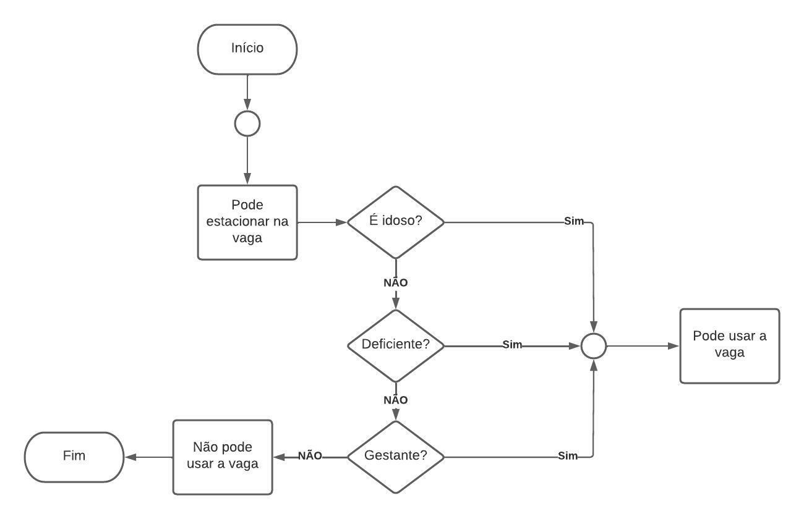

# Exercício 1 da AC2
Estacionamento

## Algoritmo do Exercício
    Início
        Se for idoso ou deficiente ou gestante? Faça
            Pode estacionar
        Se não
            Não pode Estacionar
        Fim Se
    Fim

## Fluxograma

 
